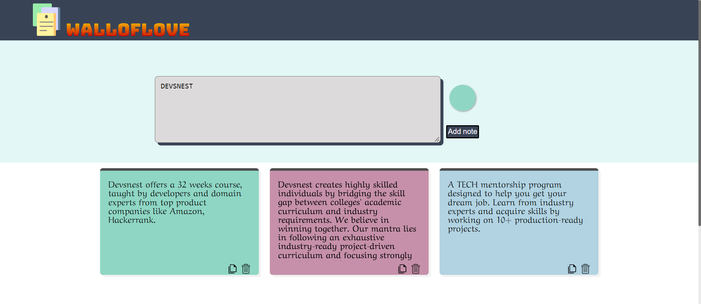

# 📒 WallofLove
A simple colorful,Desktop First , Mobile-friendly sticky notes app.

- Add short notes
- Choose different colors for notes
- Delete a Note
- Copy Text from the Note

## Desktop Screenshots

 ## Mobile Screenshots
 

## Built with
HTML, CSS and Vanilla JS

## Demo
We have Hosted it on Netlify.
You can see live demo [here](https://walloflove.netlify.app).

## Contributing
Pull requests are welcome. For major changes, please open an issue first to discuss what you would like to change.
